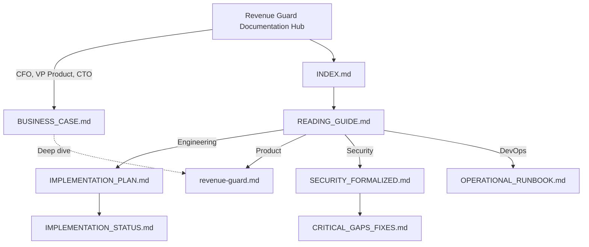

# 📚 Revenue Guard: Complete Document Index

**Created**: February 5, 2026  
**Total Pages**: 12,000+ lines across 18 documents  
**Status**: ✅ Complete and ready for use

---

## Quick Navigation

### 🚀 For Decision Makers (Executive Brief)

**[BUSINESS_CASE.md](BUSINESS_CASE.md)** ⭐ **START HERE**  
→ Evidence-backed analysis: cost savings ($218k/year), revenue protection ($115k+), ROI (26.9x)  
→ Competitive benchmarks, performance data, implementation timeline  
→ Read time: 15 minutes | Audience: C-Suite, CFO, VP Product

### 📖 For Engineering Teams

**[READING_GUIDE.md](READING_GUIDE.md)**  
→ Quick start guide for: Engineering Lead, Product, Security, DevOps, Frontend, Backend

### 📋 Technical Design

**[revenue-guard.md](revenue-guard.md)**  
→ Comprehensive technical design for inventory allocation and revenue protection

### 🔒 Security Deep Dive

**[docs/operational/SECURITY_FORMALIZED.md](../operational/SECURITY_FORMALIZED.md)**  
→ Threat model matrix, encryption, compliance, secret management

### 🔧 Operations Guide

**[docs/operational/OPERATIONAL_RUNBOOK.md](../operational/OPERATIONAL_RUNBOOK.md)**  
→ incident procedures: diagnosis, root causes, resolution

### 🎯 Gap Analysis

**[docs/implementation/CRITICAL_GAPS_FIXES.md](../implementation/CRITICAL_GAPS_FIXES.md)**  
→ All critical gaps mapped to fixes with validation

### 📊 Status Overview

**[docs/implementation/IMPLEMENTATION_STATUS.md](../implementation/IMPLEMENTATION_STATUS.md)**  
→ High-level overview and success metrics by phase

---

## Document Relationships



---

## By Audience

### 👨‍💼 Executive / Decision Maker

```
Read in order:
1. BUSINESS_CASE.md (15 min) ← START HERE
   - Financial justification
   - ROI analysis (26.9x)
   - Risk mitigation
2. Optional: READING_GUIDE.md → Executive section

Action: Approve Phase 1 (Weeks 1-4, $15k)
```

### 👨‍💼 Engineering Lead

```
Read in order:
1. BUSINESS_CASE.md (Executive context)
2. IMPLEMENTATION_STATUS.md (5 min)
3. IMPLEMENTATION_PLAN.md (20 min)
4. CRITICAL_GAPS_FIXES.md (15 min)

Action: Schedule team kickoff (Feb 5, 10am)
```

### 📦 Product Manager

```
Read in order:
1. READING_GUIDE.md (5 min) ← Product section
2. IMPLEMENTATION_PLAN.md (Phase 0 only)
3. CRITICAL_GAPS_FIXES.md (Gap #9)

Action: Prepare UI review criteria
```

### 🔒 Security Lead

```
Read in order:
1. SECURITY_FORMALIZED.md (20 min) ← Threat matrix
2. CRITICAL_GAPS_FIXES.md (Gap #2)
3. OPERATIONAL_RUNBOOK.md (Escalation)

Action: Schedule security review (Week 4)
```

### 🔧 DevOps/SRE

```
Read in order:
1. OPERATIONAL_RUNBOOK.md (15 min) ← procedures
2. IMPLEMENTATION_PLAN.md (Phase 2.1-2.3)
3. SECURITY_FORMALIZED.md (Rate limiting)

Action: Create Cloudflare account (Feb 5)
```

### 🎨 Frontend Developer

```
Read in order:
1. IMPLEMENTATION_PLAN.md (Phase 0) ← UI validation
2. CRITICAL_GAPS_FIXES.md (Gap #9)
3. READING_GUIDE.md (Frontend section)

Action: Start Vite + React (Feb 5)
```

### ⚙️ Backend Developer

```
Read in order:
1. IMPLEMENTATION_PLAN.md (Phase 1) ← Backend core
2. CRITICAL_GAPS_FIXES.md (Gaps #1, #6, #9)
3. OPERATIONAL_RUNBOOK.md (Diagnostic hints)

Action: Review rate limiting (Feb 5)
```

---

## Document Details

### DELIVERABLES.md (Executive Summary)

- **Purpose**: Overview of what was delivered, what changed, what to do now
- **Best For**: Leadership, quick overview, deciding what to read next
- **Key Sections**:
  - What you asked for vs what you got
  - 4-week phased plan diagram
  - Critical gaps fixed
  - Critical dates
  - FAQ

### READING_GUIDE.md (Quick Start)

- **Purpose**: Identify your role, find what to read
- **Best For**: Team members, "what should I read?"
- **Key Sections**:
  - By role (engineering lead, product, security, DevOps, frontend, backend)
  - 30-second summary
  - Phase overview
  - Common questions

### revenue-guard.md (Technical Design)

- **Purpose**: Comprehensive technical blueprint for the Revenue Guard system
- **Best For**: Architects, backend engineers, developers
- **Key Sections**:
  - Comparative simulation strategy (D1 vs DO)
  - Inventory allocation mechanisms
  - Durable Object state management
  - Revenue protection philosophy

### IMPLEMENTATION_PLAN.md (Detailed Timeline)

- **Purpose**: Complete phase-by-phase plan with deliverables
- **Best For**: Project leads, planning work
- **Key Sections**:
  - Phase 0: UI Validation (Week 1)
  - Phase 1: Backend Core (Week 2)
  - Phase 2: Observability (Week 3)
  - Phase 3: Security & Launch (Week 4)
  - Success criteria for each phase

### SECURITY_FORMALIZED.md (Threat & Compliance)

- **Purpose**: Formal security documentation
- **Best For**: Security team, code reviewers, compliance discussions
- **Key Sections**:
  - Threat Model Matrix (8 threats, all mitigated)
  - Encryption & key management
  - Rate limiting strategy
  - Compliance framework (demo vs production)

### OPERATIONAL_RUNBOOK.md (Incident Procedures)

- **Purpose**: How to handle incidents when they occur
- **Best For**: On-call engineers, SREs, troubleshooting
- **Key Sections**:
  - Detailed procedure for common issues:
    - DO instance crashes
    - D1 quota exceeded
    - Rate limiting issues
    - WebSocket disconnects
    - Latency spikes

### CRITICAL_GAPS_FIXES.md (Gap Analysis)

- **Purpose**: What was wrong, how it's fixed
- **Best For**: Architects, understanding the "why"
- **Key Sections**:
  - Executive summary (all 10 gaps + phases)
  - Detailed analysis of each gap
  - How to validate each fix

---

## File Locations

```
cf-revenue-guard/
│
├── 📄 README.md (project overview)
│
└── docs/
    ├── planning/
    │   ├── 📄 INDEX.md (you are here)
    │   ├── 📄 READING_GUIDE.md
    │   ├── 📄 DELIVERABLES.md
    │   └── 📄 revenue-guard.md
    │
    ├── implementation/
    │   ├── 📄 IMPLEMENTATION_PLAN.md
    │   ├── 📄 IMPLEMENTATION_STATUS.md
    │   ├── 📄 CRITICAL_GAPS_FIXES.md
    │   └── 📄 WORK_CHECKLIST.md
    │
    ├── operational/
    │   ├── 📄 SECURITY_FORMALIZED.md
    │   └── 📄 OPERATIONAL_RUNBOOK.md
    │
    └── original-spec/
        ├── 📄 01-executive-summary.md
        ├── ... (other specs)
        └── 📄 15-quick-reference.md
```

---

## Quick Links

| Need                   | File                   | Section            |
| ---------------------- | ---------------------- | ------------------ |
| Overview               | DELIVERABLES.md        | Top                |
| Role assignment        | READING_GUIDE.md       | "If you're a..."   |
| 4-week plan            | IMPLEMENTATION_PLAN.md | Phase overview     |
| Security review        | SECURITY_FORMALIZED.md | Threat matrix      |
| Incident response      | OPERATIONAL_RUNBOOK.md | procedures         |
| Gap details            | CRITICAL_GAPS_FIXES.md | Gap #1-10          |
| Phase success criteria | IMPLEMENTATION_PLAN.md | Each phase section |
| Technical Design       | revenue-guard.md       | Architecture       |

---

## Summary

This documentation hub provides everything needed to implement, operate, and secure the **Revenue Guard** system.

🚀 **Let's protect that revenue!** 🚀
